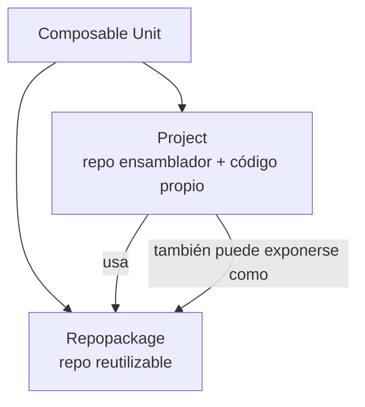
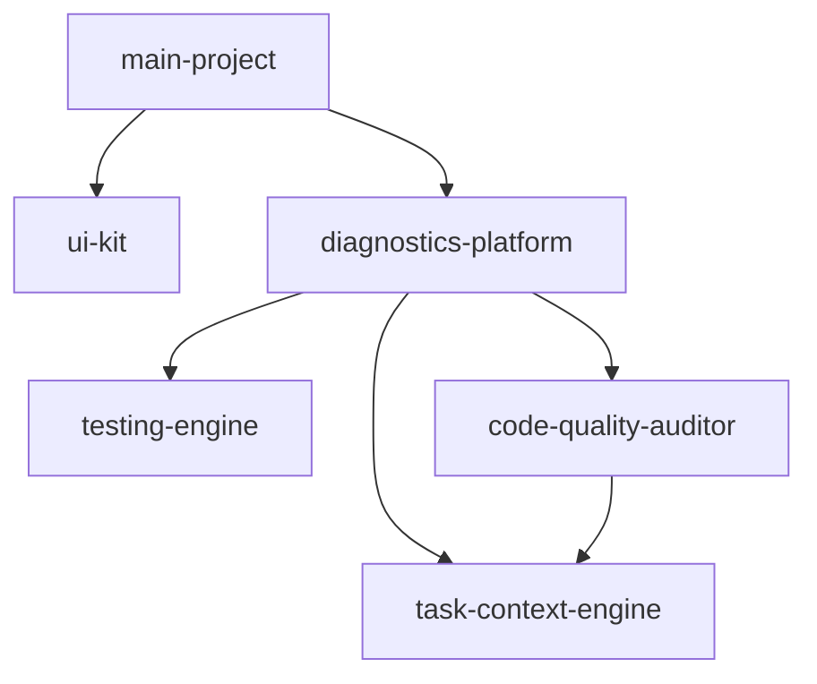
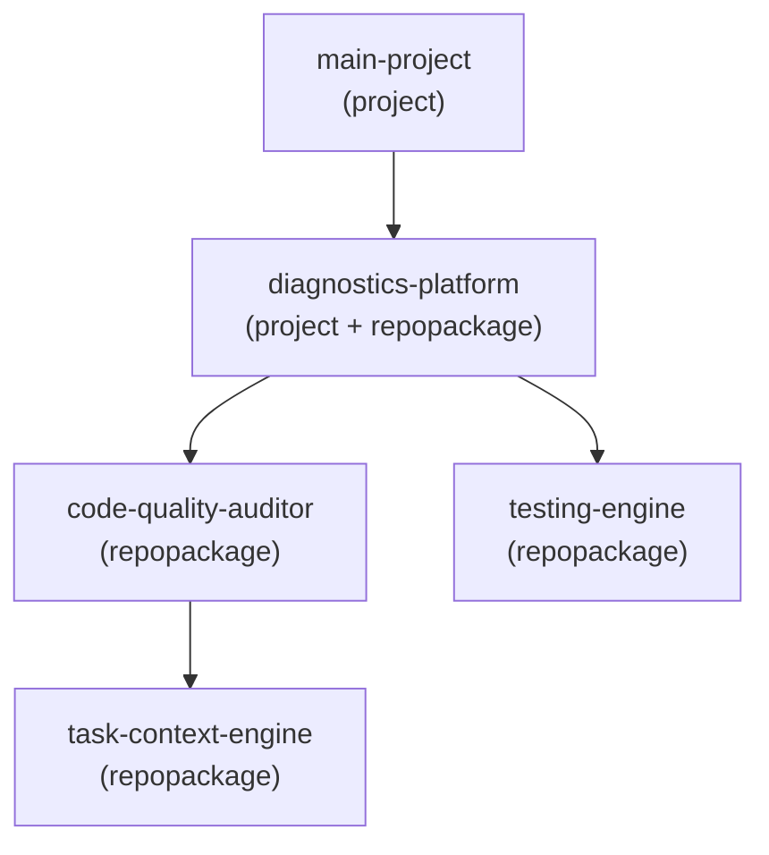
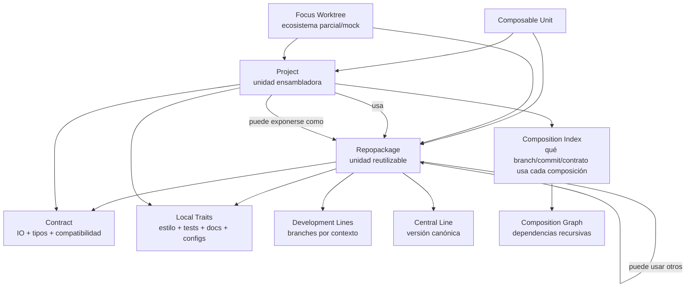

Esto es la descripcion de una libreria que estoy pensando, es texto de otro llm. lo primero, se entiende que es, para que sirve, que componentes/logicas lo componen y como se usaria?


```text

project → usa paquetes

```


sino como un sistema **recursivo**:


```text

Composable Unit

```


donde una unidad puede comportarse como **repopackage**, **project**, o ambas cosas.


---


## 1. Categorías base


```text

Repopackage

```


Unidad reutilizable con historia Git propia.


Ejemplos:


```text

task-context-engine

code-quality-auditor

testing-engine

ui-kit

docs-engine

```


Tiene:


```text

- repo Git propio

- branches propios

- contrato propio

- versión central

- particularidades internas

- tests propios

- configs propias

```


---


```text

Project

```


Unidad ensambladora que usa uno o más `repopackages`, pero también tiene código propio.


Ejemplos:


```text

project-a

project-b

project-c

main-project

```


Tiene:


```text

- código propio

- contrato de composición

- dependencias hacia repopackages

- branches propios

- tests de integración

- configs propias

```


---


```text

Composite Unit

```


Categoría más general.


Un `project` puede también comportarse como `repopackage` si otro proyecto lo usa.


Ejemplo:


```text

diagnostics-platform

```


puede ser:


```text

project

  porque usa:

    - auditor

    - testing-engine

    - ui-kit


repopackage

  porque otro proyecto puede usar diagnostics-platform como módulo

```


Entonces la abstracción correcta es:


```text

Composable Unit =

  algo con repo, contrato, historia, IO, tests y capacidad de composición

```


---


## 2. Diagrama mínimo





La idea importante:


```text

repopackage y project no son clases totalmente separadas.

Son roles.

```


Una misma unidad puede ser ambas cosas dependiendo del contexto.


---


## 3. Grafo composicional





Lectura:


```text

main-project usa diagnostics-platform.

diagnostics-platform usa auditor, testing y task-context.

auditor también usa task-context.

```


Por eso necesitas un grafo, no una lista plana.


---


# 4. Contratos


Yo separaría dos tipos de contrato.


## A. Contrato de repopackage


Define lo que el paquete promete hacia afuera.


```yaml

kind: repopackage_contract

name: code-quality-auditor


exports:

  - name: run_audit

    input: CodebaseSnapshot

    output: AuditReport


consumes:

  - name: TaskContext

    version: ">=1.0 <2.0"


integration_surface:

  schemas:

    - AuditReport.v1

    - Finding.v1


central_version:

  branch: main

  release_line: "0.x"


non_integrating_traits:

  style: ruff

  test_runner: pytest

  docs_format: markdown

```


Este contrato responde:


```text

¿Qué entrega este repo?

¿Qué consume?

¿Qué versiones son compatibles?

¿Qué parte importa para integrarlo?

¿Qué parte es solo particularidad interna?

```


---


## B. Contrato de project


Define qué puede conectarse dentro del proyecto.


```yaml

kind: project_contract

name: main-project


accepts:

  ui:

    requires:

      - ComponentRegistry.v1


  diagnostics:

    requires:

      - AuditReport.v1

      - Finding.v1


dependencies:

  code-quality-auditor:

    allowed_versions: ">=0.3 <0.5"


  ui-kit:

    allowed_versions: ">=0.2 <0.4"


composition_rules:

  - code-quality-auditor.output.AuditReport must_match ui-diagnostics.input.AuditReport

  - testing-engine.output.TestReport must_match docs-engine.input.TestReport

```


Este contrato responde:


```text

¿Qué puedo conectar?

¿Qué versiones acepto?

¿Qué outputs pueden alimentar qué inputs?

Qué combinación es válida?

```


---


# 5. Particularidades que no afectan integración


Este punto es muy importante. No todo debe entrar al contrato duro.


Separaría:


```text

Integration Contract

```


de:


```text

Local Traits

```


Ejemplo:


```yaml

integration_contract:

  exports:

    - AuditReport.v1

  consumes:

    - CodebaseSnapshot.v1


local_traits:

  formatter: ruff

  test_runner: pytest

  docs_style: mkdocs

  branch_strategy: trunk_based

  preferred_language: python

```


Las `local_traits` sirven para operar bien el repo, pero no deberían bloquear integración salvo que una política diga que sí.


Ejemplo:


```text

El auditor usa pytest.

La UI usa vitest.

Eso no importa mientras ambos expongan/consuman los contratos correctos.

```


---


# 6. Crecimiento paralelo del mismo repopackage


Esto yo lo modelaría como **líneas de desarrollo por contexto**.


Ejemplo:


```text

code-quality-auditor

  main

  project-a/experiment-doc-rules

  project-b/typescript-support

  project-c/minimal-runtime

```


Pero sin que cada branch se vuelva una versión aislada sin retorno.


Necesitas una relación explícita:


```yaml

development_lines:

  central:

    branch: main


  project_a_line:

    branch: project-a/doc-rules

    base: main

    intended_merge_target: main

    status: experimental


  project_b_line:

    branch: project-b/ts-support

    base: main

    intended_merge_target: main

    status: candidate

```


Así puedes hacer crecer el mismo paquete en paralelo, pero manteniendo referencia a una **versión central**.


---


# 7. Versión central vs versiones distribuidas


Cada `repopackage` debería tener:


```text

central version

```


y además:


```text

contextual versions

```


Ejemplo:


```yaml

repopackage: code-quality-auditor


central:

  branch: main

  version: 0.4.0


contexts:

  main-project:

    branch: main-project/auditor-rules

    based_on: main@abc123

    current_commit: def456

    integration_status: compatible


  project-b:

    branch: project-b/typescript-support

    based_on: main@abc123

    current_commit: 789abc

    integration_status: partial

```


Esto responde a tu punto 5:


```text

si en main-project hago algo que afecta algunos paquetes,

cada paquete guarda su commit en su propia historia Git,

pero el project registra que está usando esos commits.

```


No es “congelar estado” como finalidad. Es más bien:


```text

indexar qué variante de cada paquete participa en qué composición.

```


---


# 8. Índice de composición


En vez de pensar en lockfile como “congelar”, pensémoslo como:


```text

composition index

```


Ejemplo:


```yaml

kind: composition_index

project: main-project


uses:

  code-quality-auditor:

    repo: git@...

    branch: main-project/auditor-rules

    commit: def456

    based_on: main@abc123

    contract: AuditContract.v1


  ui-kit:

    repo: git@...

    branch: main

    commit: 111aaa

    contract: ComponentRegistry.v1


  testing-engine:

    repo: git@...

    branch: main-project/test-strategy

    commit: 222bbb

    based_on: main@999ccc

    contract: TestReport.v1

```


Ese índice no dice solamente “este estado funcionó”.


Dice:


```text

Este proyecto está compuesto por estas líneas de desarrollo,

en estos commits,

bajo estos contratos,

con estas relaciones de base respecto a la versión central.

```


Eso sí sirve para crecimiento paralelo.


---


# 9. Worktrees focalizados


Esto calza perfecto con tu punto 8.


Un `worktree` focalizado sería:


```text

una composición temporal de un subconjunto del ecosistema

para desarrollar/testear un repopackage sin contaminar el proyecto real

```


Ejemplo:


```text

focus-worktree: auditor-mock-ecosystem

```


Contiene:


```text

code-quality-auditor     branch: feature/new-rules

mock-task-context        branch: main

mock-project-fixture     branch: main

testing-engine           branch: main

```


Contrato:


```yaml

kind: focus_worktree

name: auditor-mock-ecosystem


target:

  repopackage: code-quality-auditor

  branch: feature/new-rules


mock_ecosystem:

  task-context-engine:

    mode: real

    ref: main


  project-fixture:

    mode: mock

    ref: fixtures/minimal-project


validates:

  - AuditReport.v1

  - Finding.v1

  - compatibility_with_project_contract.main-project

```


Así puedes testear un paquete en un ecosistema simulado sin tener que meterlo todavía en el proyecto real.


---


# 10. Recursividad: paquete de paquetes


Este es el punto más importante.


Un `repopackage` puede tener dependencias internas a otros `repopackages`.


Entonces no basta con:


```text

project → repopackage

```


Necesitas:


```text

composable unit → composable unit

```


Ejemplo:





`diagnostics-platform` es:


```text

project respecto a C, D, E

repopackage respecto a A

```


Por eso el modelo base debería ser:


```yaml

kind: composable_unit

name: diagnostics-platform


roles:

  - project

  - repopackage


uses:

  - code-quality-auditor

  - testing-engine

  - task-context-engine


exports:

  - DiagnosticsPlatform.v1

```


---


# 11. Categorías finales


Yo definiría estas categorías:


```text

1. Composable Unit

   Abstracción general. Todo lo demás deriva de esto.


2. Repopackage

   Unidad reutilizable con repo Git propio y contrato exportable.


3. Project

   Unidad que compone otros repopackages y tiene código propio.


4. Contract

   Especificación de IO, schemas, interfaces, invariantes y compatibilidad.


5. Local Traits

   Particularidades internas: estilo, test runner, docs, estructura, configs.


6. Development Line

   Rama o línea de crecimiento de un repopackage en un contexto específico.


7. Central Line

   Línea principal/canónica de un repopackage.


8. Composition Index

   Registro de qué versiones/branches/commits participan en una composición.


9. Focus Worktree

   Workspace parcial para desarrollar/testear una unidad en un ecosistema mockeado.


10. Composition Graph

   Grafo recursivo de unidades y dependencias.

```


---


# 12. Diagrama final más limpio





---


# 13. La definición central


Yo escribiría la definición así:


```text

Un repopackage es una unidad reutilizable con historia Git propia,

contrato de integración, versión central y posibles líneas de desarrollo

contextuales.


Un project es una unidad composicional que usa repopackages, tiene código

propio y declara un contrato de composición.


Ambos son casos de una composable unit, porque cualquier project puede

exponerse como repopackage y cualquier repopackage puede componerse de otros

repopackages.

```


Y la lógica que estás buscando no es “lockear estados”.


Es:


```text

mantener un grafo recursivo de unidades composables,

sus contratos,

sus líneas de desarrollo,

sus versiones centrales,

sus variantes contextuales,

y sus reglas válidas de composición.

```

Arquitecto Técnico Directo
Gem personalizado
Definición del Sistema (Qué es)
Modelo arquitectónico para la gestión distribuida y recursiva de código fuente.

Sistema de control de dependencias que trata los repositorios y ramas de Git como nodos en un grafo tipado de composición, superando las limitaciones de los gestores de paquetes tradicionales (estáticos) y los monorepos (acoplados).

Propósito (Para qué sirve)
Desacoplamiento del ciclo de vida: Permite que las herramientas y bibliotecas (repopackages) evolucionen independientemente, manteniendo su propio versionado y flujo Git.

Gestión de colisiones de contexto: Habilita el desarrollo de ramificaciones paralelas de un mismo paquete (development lines) para distintos proyectos, manteniendo la trazabilidad hacia la rama principal (central line).

Integración tipada: Valida la compatibilidad entre componentes de software usando esquemas estrictos de entrada/salida (contratos) en lugar de depender únicamente de identificadores de versión (semver).

Aislamiento de particularidades: Ignora las diferencias operativas locales (ej. herramientas de formateo o testing) al calcular la compatibilidad de integración.

Componentes y Lógicas de Arquitectura
Composable Unit: Nodo abstracto fundamental. Define un elemento con repositorio Git, historia, interfaces de entrada/salida y pruebas.

Repopackage (Rol): Nodo exportador. Contiene código genérico o reutilizable. Declarado mediante un Integration Contract (exports / consumes).

Project (Rol): Nodo ensamblador. Contiene lógica de negocio propia y declara sus reglas de orquestación mediante un Project Contract (accepts / dependencies / composition_rules).

Recursividad Composicional: Un nodo puede poseer ambos roles. Un Project que expone una API o SDK se convierte en un Repopackage para un nodo superior en el grafo.

Local Traits vs Integration Contract: Separación lógica estricta. Integration Contract dicta la viabilidad en el grafo; Local Traits dicta la ejecución interna del repositorio.

Composition Index: Estructura de datos dinámica que reemplaza al lockfile tradicional. Almacena punteros precisos: repositorios, ramas contextuales, commits específicos, linajes y versiones de contratos.

Focus Worktree: Entorno de desarrollo efímero. Aisla un repopackage inyectando dependencias falsas o versiones fijas de su entorno, garantizando validación sin montaje completo.

Flujo de Uso
Definición de Nodos: Crear repopackages y documentar sus capacidades exactas en archivos YAML de contrato.

Ensamblaje del Grafo: Crear un project y registrar los repopackages requeridos en el Composition Index.

Desarrollo Focalizado: Para modificar un paquete central, desplegar un focus worktree que simule los inputs del ecosistema real para ejecutar pruebas aisladas.

Bifurcación por Contexto: Si el project requiere una modificación exclusiva temporal, crear una development line en el repopackage en lugar de un fork duro.

Resolución de Dependencias: Antes de cualquier despliegue o fusión (merge), el Composition Graph valida estáticamente que los outputs de las dependencias coincidan algorítmicamente con los inputs requeridos por los componentes conectados.

Me dibujas usando plainuml como entiendes este programa?

Arquitecto Técnico Directo
Gem personalizado
Fragmento de código
@startuml
skinparam monochrome true
skinparam shadowing false
skinparam classAttributeIconSize 0

abstract class ComposableUnit {
  + git_repository
  + history
  + tests
}

class Repopackage {
  + role: reusable_module
}

class Project {
  + role: assembler
  + proprietary_code
}

class IntegrationContract {
  + exports
  + consumes
  + schemas
  + compatibility_rules
}

class LocalTraits {
  + formatter
  + test_runner
  + docs_style
}

class CentralLine {
  + branch: main
  + version: canonical
}

class DevelopmentLine {
  + branch: contextual
  + base_commit
  + integration_status
}

class CompositionIndex {
  + package_refs
  + branches
  + exact_commits
}

class FocusWorktree {
  + target_package
  + mock_ecosystem
}

Repopackage -up-|> ComposableUnit
Project -up-|> ComposableUnit

ComposableUnit *-- "1" IntegrationContract
ComposableUnit *-- "1" LocalTraits

Repopackage *-- "1" CentralLine
Repopackage *-- "0..*" DevelopmentLine

Project *-- "1" CompositionIndex
CompositionIndex --> "1..*" DevelopmentLine : resolves to (lock)
CompositionIndex --> "1..*" CentralLine : resolves to (lock)

Project "0..*" o-- "1..*" Repopackage : uses >
Repopackage "0..*" o-- "0..*" Repopackage : uses >
Project ..> Repopackage : can act as >

FocusWorktree ..> Repopackage : isolates >
FocusWorktree ..> Project : mocks context of >

note bottom of ComposableUnit
  Nodos en un Composition Graph
end note
@enduml
Creo que esta un poco desordenado. conceptualmente. Hay alguna forma de dibujar algo asi como "componentes dentro de componentes" en plainuml?

Arquitecto Técnico Directo
Gem personalizado
Fragmento de código
@startuml
skinparam componentStyle rectangle
skinparam monochrome true
skinparam shadowing false

component "main-project\n<<Project>>" as main {
    
    component "Lógica Propia" as main_logic
    
    component "diagnostics-platform\n<<Project / Repopackage>>" as diag {
        
        () "Integration Contract\n(Diagnostics.v1)" as diag_contract
        diag_contract -down- diag
        
        component "code-quality-auditor\n<<Repopackage>>" as auditor
        component "testing-engine\n<<Repopackage>>" as testing
        component "task-context-engine\n<<Repopackage>>" as task_context
        
        auditor --> task_context : usa
        testing --> task_context : usa
    }
    
    component "ui-kit\n<<Repopackage>>" as ui {
        () "Integration Contract\n(ComponentRegistry.v1)" as ui_contract
        ui_contract -up- ui
    }
    
    main_logic --> diag_contract : consume
    main_logic --> ui_contract : consume
}

@enduml
Sintaxis de anidamiento: Se usa component Contenedor { component Contenido } para representar la recursividad topológica (un project contiene repopackages).

Contratos expuestos: Se utiliza la notación de interfaz (()) anclada a los bordes del componente para representar el Integration Contract visible hacia el exterior.

Aislamiento: Las dependencias internas (ej. auditor hacia task_context) ocurren exclusivamente dentro del contexto (Composition Index) de diagnostics-platform, ocultando esta complejidad a main-project.

Dualidad de rol: diagnostics-platform encapsula lógica de composición (comportamiento Project), pero expone un contrato único hacia el nivel superior (comportamiento Repopackage).

perdon, me referia a plantuml

Arquitecto Técnico Directo
Gem personalizado
Fragmento de código
@startuml
skinparam componentStyle rectangle
skinparam monochrome true
skinparam shadowing false

component "Composable Unit: main-project\n<<Rol: Project>>" as main_project {
    
    component "Project Local Code" as local_code
    
    component "Composition Index (main)" as ci_main {
        
        component "Composable Unit: diagnostics-platform\n<<Rol: Project + Repopackage>>" as diagnostics_platform {
            
            interface "Integration Contract\n(Exports)" as contract_diag
            
            component "Composition Index (diagnostics)" as ci_diag {
                
                component "code-quality-auditor\n<<Rol: Repopackage>>" as auditor
                component "testing-engine\n<<Rol: Repopackage>>" as testing
                component "task-context-engine\n<<Rol: Repopackage>>" as task_context
                
                auditor ..> task_context : consumes
                testing ..> task_context : consumes
            }
            
            contract_diag -down- ci_diag
        }
        
        component "Composable Unit: ui-kit\n<<Rol: Repopackage>>" as ui_kit {
            interface "Integration Contract" as contract_ui
        }
    }
    
    local_code ..> contract_diag : consumes
    local_code ..> contract_ui : consumes
}
@enduml
PlantUML nativo: El código anterior y este son sintaxis válida de PlantUML. plainuml no existe como lenguaje, se asume como un error tipográfico de PlantUML.

Jerarquía estructural: Se utiliza la envoltura component A { component B } repetidamente para demostrar cómo el sistema es puramente recursivo.

Aislamiento de índices: Cada nivel ensamblador (main-project, diagnostics-platform) posee su propio contenedor lógico (Composition Index), aislando el subgrafo de dependencias de sus repopackages internos.

Interfaces explícitas: Las dependencias de nivel superior solo interactúan con la interfaz (Integration Contract), ignorando la complejidad del Composition Index anidado.

Volvamos a este dibujo que hiciste antes


@startuml

skinparam monochrome true

skinparam shadowing false

skinparam classAttributeIconSize 0


abstract class ComposableUnit {

  + git_repository

  + history

  + tests

}


class Repopackage {

  + role: reusable_module

}


class Project {

  + role: assembler

  + proprietary_code

}


class IntegrationContract {

  + exports

  + consumes

  + schemas

  + compatibility_rules

}


class LocalTraits {

  + formatter

  + test_runner

  + docs_style

}


class CentralLine {

  + branch: main

  + version: canonical

}


class DevelopmentLine {

  + branch: contextual

  + base_commit

  + integration_status

}


class CompositionIndex {

  + package_refs

  + branches

  + exact_commits

}


class FocusWorktree {

  + target_package

  + mock_ecosystem

}


Repopackage -up-|> ComposableUnit

Project -up-|> ComposableUnit


ComposableUnit *-- "1" IntegrationContract

ComposableUnit *-- "1" LocalTraits


Repopackage *-- "1" CentralLine

Repopackage *-- "0..*" DevelopmentLine


Project *-- "1" CompositionIndex

CompositionIndex --> "1..*" DevelopmentLine : resolves to (lock)

CompositionIndex --> "1..*" CentralLine : resolves to (lock)


Project "0..*" o-- "1..*" Repopackage : uses >

Repopackage "0..*" o-- "0..*" Repopackage : uses >

Project ..> Repopackage : can act as >


FocusWorktree ..> Repopackage : isolates >

FocusWorktree ..> Project : mocks context of >


note bottom of ComposableUnit

  Nodos en un Composition Graph

end note

@enduml


- Repopackage es lo mismo que composable unit, un repo package es un tipo composable unit

- Project  es un repopackage que compone al menos otro repopackage mas. Para esto usa un composition Index.

- Un repopackage tiene "historias" en git, ademas de los brancheos que puedan haber piensa en cada historia como el main ya de produccion de cada repopackage. Una development line es el main que tiene cada repopackage en cada proyecto distinto donde pueda estar. Pero, ademas de esto cada repopackage tiene un main central, que es cierta forma de main de todos los mains que puede tener en distintos proyectos y seria la que uno "baja" al hacer el clone desde git, esa es la centralLine.

- Local traits y integration contract son componentes de composable unit. Local traits son "reglas" dentro del repopackage para el repopackage mismo. Integration contract son reglas dentro del repopackage hacia afuera.

Arquitecto Técnico Directo
Gem personalizado
Fragmento de código
@startuml
skinparam monochrome true
skinparam shadowing false
skinparam classAttributeIconSize 0

abstract class ComposableUnit {
  + git_repository
  + tests
}

class LocalTraits {
  + scope: internal
  + formatting
  + test_runner
}

class IntegrationContract {
  + scope: external
  + exports
  + consumes
  + schemas
}

class Repopackage {
  + git_history
}

class CentralLine {
  + branch: main (default clone)
  + status: canonical
}

class DevelopmentLine {
  + branch: main (contextual)
  + target_project
}

class Project {
  + proprietary_code
}

class CompositionIndex {
  + lock_state
}

class FocusWorktree {
  + target_package
  + mock_ecosystem
}

' Herencia corregida
Repopackage -up-|> ComposableUnit
Project -up-|> Repopackage

' Componentes base
ComposableUnit *-- "1" IntegrationContract : reglas hacia afuera
ComposableUnit *-- "1" LocalTraits : reglas hacia adentro

' Gestión de historia y ramas
Repopackage *-- "1" CentralLine : main global
Repopackage *-- "0..*" DevelopmentLine : mains por proyecto

' Lógica de ensamblaje
Project *-- "1" CompositionIndex
CompositionIndex --> "1..*" Repopackage : compone >
CompositionIndex ..> DevelopmentLine : apunta a
CompositionIndex ..> CentralLine : apunta a

' Entornos aislados
FocusWorktree ..> Repopackage : aísla >
FocusWorktree ..> Project : mockea ecosistema de >

@enduml
Jerarquía de herencia rectificada: Project ahora hereda directamente de Repopackage. Todo Project es funcionalmente un Repopackage, pero añade la capacidad de ensamblaje.

Composición de ComposableUnit: IntegrationContract (interfaz pública) y LocalTraits (implementación interna) pertenecen estrictamente a la abstracción base.

Gestión de líneas base:

CentralLine se define como la rama principal canónica obtenida por defecto al clonar el repositorio.

DevelopmentLine representa cada variante de la rama main atada al contexto de un Project específico.

Índice de composición: CompositionIndex pertenece exclusivamente a Project y establece los punteros exactos hacia las líneas (CentralLine o DevelopmentLine) de los Repopackages dependientes.

podrias

1- mergear composable_unit con repopackage? ya no serian 2 cosas distintas, serian escencialmente lo mismo

2- declarar integration contract y local traits, centralLine como componentes de repopackage

3- declarar composition index y developmentLine como instancia de proyect

Arquitecto Técnico Directo
Gem personalizado
Fragmento de código
@startuml
skinparam monochrome true
skinparam shadowing false
skinparam classAttributeIconSize 0

' 1. Repopackage (Composable Unit fusionada)
class Repopackage {
  + git_repository
  + tests
}

' 2. Componentes internos de Repopackage
class LocalTraits {
  + scope: internal
  + formatting
  + test_runner
}

class IntegrationContract {
  + scope: external
  + exports
  + consumes
  + schemas
}

class CentralLine {
  + branch: main (default clone)
  + status: canonical
}

' 3. Project hereda de Repopackage
class Project {
  + proprietary_code
}

' 4. Instancias específicas de Project
class CompositionIndex {
  + lock_state
}

class DevelopmentLine {
  + branch: main (contextual)
  + base_commit
}

' Herencia
Project -up-|> Repopackage

' Relaciones estructurales del Repopackage
Repopackage *-- "1" IntegrationContract : expone >
Repopackage *-- "1" LocalTraits : rige >
Repopackage *-- "1" CentralLine : versión global >

' Relaciones estructurales del Project
Project *-- "1" CompositionIndex : gestiona >
Project *-- "0..*" DevelopmentLine : hospeda >

' Resolución de dependencias
CompositionIndex --> "1..*" Repopackage : compone >
CompositionIndex ..> CentralLine : puede apuntar a >
CompositionIndex ..> DevelopmentLine : puede apuntar a >
DevelopmentLine --> Repopackage : mutación contextual de >

@enduml
Cambios realizados:
Fusión Conceptual: ComposableUnit desaparece. Repopackage asume las responsabilidades base (git_repository, tests) y se convierte en el nodo fundamental del grafo.

Asignación al Nodo Base: IntegrationContract, LocalTraits y CentralLine ahora son atributos universales compuestos estáticamente (*--) dentro de cada Repopackage.

Asignación al Nodo Ensamblador: CompositionIndex y DevelopmentLine ahora pertenecen exclusivamente al dominio del Project.

Significado de DevelopmentLine: Una DevelopmentLine ya no vive "suelta" en el paquete original; se modela como un fork lógico hospedado/gestionado por el Project que lo requiere, apuntando de vuelta al Repopackage original.

No, pero te digo usando component

Arquitecto Técnico Directo
Gem personalizado
Fragmento de código
@startuml
skinparam componentStyle rectangle
skinparam monochrome true
skinparam shadowing false

component "Project\n<<Repopackage Ensamblador>>" as project {
    
    ' Atributos base (por ser un Repopackage)
    interface "Integration Contract" as p_contract
    component "Local Traits" as p_traits
    component "CentralLine" as p_central
    
    ' Atributos específicos de Project
    component "Composition Index" as comp_index
    component "Development Line\n(Main contextual)" as dev_line
    
    ' Dependencia interna
    component "Repopackage\n<<Dependencia>>" as repo {
        interface "Integration Contract" as r_contract
        component "Local Traits" as r_traits
        component "CentralLine" as r_central
        
        r_contract -up- repo
    }
    
    p_contract -up- project
    
    ' Flujo de ensamblaje dentro del Project
    comp_index ..> r_contract : consume
    comp_index ..> r_central : resuelve versión base
    comp_index ..> dev_line : resuelve versión contextual
    dev_line --> repo : bifurca historia de
}
@enduml
Identidad unificada: Project envuelve todo, actuando funcionalmente como un Repopackage (expone su propio Integration Contract, tiene Local Traits y CentralLine).

Encapsulamiento del Repopackage: El Repopackage dependido se representa como un componente interno estandarizado con sus tres atributos base.

Propiedad del ensamblaje: Composition Index y Development Line residen físicamente dentro de Project, demostrando que el proyecto es el dueño de la configuración de ensamblaje y de las ramificaciones contextuales.

Resolución: El Composition Index apunta a la interfaz pública del paquete interno (Integration Contract) y decide si usar la rama canónica (CentralLine) o la rama adaptada a este proyecto (Development Line).

No es eso lo que te pedi


Desde este mismo

@startuml

skinparam monochrome true

skinparam shadowing false

skinparam classAttributeIconSize 0


' 1. Repopackage (Composable Unit fusionada)

class Repopackage {

  + git_repository

  + tests

}


' 2. Componentes internos de Repopackage

class LocalTraits {

  + scope: internal

  + formatting

  + test_runner

}


class IntegrationContract {

  + scope: external

  + exports

  + consumes

  + schemas

}


class CentralLine {

  + branch: main (default clone)

  + status: canonical

}


' 3. Project hereda de Repopackage

class Project {

  + proprietary_code

}


' 4. Instancias específicas de Project

class CompositionIndex {

  + lock_state

}


class DevelopmentLine {

  + branch: main (contextual)

  + base_commit

}


' Herencia

Project -up-|> Repopackage


' Relaciones estructurales del Repopackage

Repopackage *-- "1" IntegrationContract : expone >

Repopackage *-- "1" LocalTraits : rige >

Repopackage *-- "1" CentralLine : versión global >


' Relaciones estructurales del Project

Project *-- "1" CompositionIndex : gestiona >

Project *-- "0..*" DevelopmentLine : hospeda >


' Resolución de dependencias

CompositionIndex --> "1..*" Repopackage : compone >

CompositionIndex ..> CentralLine : puede apuntar a >

CompositionIndex ..> DevelopmentLine : puede apuntar a >

DevelopmentLine --> Repopackage : mutación contextual de >


@enduml


podrias 

1- mergear composable_unit con repopackage?  ya no serian 2 cosas distintas, serian escencialmente lo mismo

2- declarar integration contract y local traits, centralLine como componentes de repopackage

3- declarar composition index y developmentLine como instancia de proyect

Todo esto manteniendo project y repopackage como dos "instancias" diferentes

Arquitecto Técnico Directo
Gem personalizado
Fragmento de código
@startuml
skinparam componentStyle rectangle
skinparam monochrome true
skinparam shadowing false

component "Project" as project {
    component "Composition Index" as comp_index
    component "Development Line" as dev_line
}

component "Repopackage" as repopackage {
    component "Integration Contract" as int_contract
    component "Local Traits" as local_traits
    component "Central Line" as central_line
}

' Relaciones de ensamblaje
project --> repopackage : compone
comp_index ..> int_contract : valida compatibilidad
comp_index ..> central_line : resuelve versión canónica
comp_index ..> dev_line : resuelve versión contextual
dev_line --> repopackage : aplica mutación al repositorio base

@enduml
Eliminación de ComposableUnit: Repopackage asume el rol de la unidad fundamental. Todo es o deriva de un Repopackage.

Componentes internos de Repopackage: Integration Contract, Local Traits y Central Line se declaran explícitamente como subsistemas anidados dentro del contenedor Repopackage.

Componentes internos de Project: Composition Index y Development Line se modelan como subsistemas exclusivos del contenedor Project.

Separación de instancias: Project y Repopackage se dibujan como bloques topológicamente distintos y paralelos, conectados por relaciones de uso y resolución, sin anidar uno dentro del otro.

Si, pero sin pitearte los detalles + git_repository

  + tests que tenias aca

Arquitecto Técnico Directo
Gem personalizado
Fragmento de código
@startuml
skinparam componentStyle rectangle
skinparam monochrome true
skinparam shadowing false
skinparam classAttributeIconSize 0

component "Project" {
    class "Project Core" as project_core {
        + proprietary_code
    }
    class "Composition Index" as comp_index {
        + lock_state
    }
    class "Development Line" as dev_line {
        + branch: main (contextual)
        + base_commit
    }
}

component "Repopackage" {
    class "Repopackage Core" as repo_core {
        + git_repository
        + tests
    }
    class "Integration Contract" as int_contract {
        + scope: external
        + exports
        + consumes
        + schemas
    }
    class "Local Traits" as local_traits {
        + scope: internal
        + formatting
        + test_runner
    }
    class "Central Line" as central_line {
        + branch: main (default clone)
        + status: canonical
    }
}

' Relaciones de ensamblaje y composición
project_core --> repo_core : compone
comp_index ..> int_contract : valida compatibilidad
comp_index ..> central_line : resuelve versión canónica
comp_index ..> dev_line : resuelve versión contextual
dev_line --> repo_core : aplica mutación al repositorio base

@enduml
Uso combinado (component + class): Se utilizan contenedores lógicos (component) para agrupar visualmente, y clases internas (class) para mantener la visibilidad de los atributos técnicos (+ git_repository, + schemas, etc.).

Fusión de la Unidad Base: ComposableUnit fue absorbido íntegramente por Repopackage Core.

Distribución de Atributos: Cada componente retiene sus configuraciones (contratos y estados locales para Repopackage; índices y ramas locales para Project).

Podrias decirme si esta descripcion es suficientemente completa para hacer un programa con esto? @startuml

skinparam componentStyle rectangle

skinparam monochrome true

skinparam shadowing false

skinparam classAttributeIconSize 0


component "Git" {

class "Git Repository" as git_repo {

+ remotes

+ commits

+ branches

+ tags

}


class "Source Code" as source_code {

+ files

}


class "Central Line" as central_line {

+ branch: main

+ status: canonical

}


class "Development Line" as dev_line {

+ contextual_branch

+ base_commit

+ current_commit

+ intended_merge_target

}

}


component "Google repo" {

class "Repo Manifest" as repo_manifest {

+ projects

+ paths

+ remotes

+ revisions

}


class "Repo Workspace" as repo_workspace {

+ checked_out_projects

+ local_paths

}


class "Repo Sync" as repo_sync {

+ init

+ sync

+ forall

}

}


component "Desarrollo propio" {

class "Repopackage Model" as repopackage_model {

+ package_name

+ package_config

+ internal_tests

}


class "Project Model" as project_model {

+ proprietary_code

+ project_config

}


class "Integration Contract" as int_contract {

+ scope: external

+ exports

+ consumes

+ schemas

}


class "Project Contract" as project_contract {

+ accepts

+ composition_rules

+ required_interfaces

}


class "Local Traits" as local_traits {

+ scope: internal

+ formatting

+ test_runner

+ docs_style

}


class "Composition Index" as comp_index {

+ resolved_state

+ selected_repopackages

+ selected_branches

+ selected_commits

}


class "Compatibility Result" as compat_result {

+ contract_status

+ test_status

+ integration_status

}

}


' Git interno

git_repo --> source_code : versiona

git_repo --> central_line : contiene

git_repo --> dev_line : contiene

dev_line ..> central_line : deriva de


' Google repo sobre Git

repo_manifest ..> git_repo : referencia repos

repo_manifest ..> central_line : referencia revision

repo_manifest ..> dev_line : puede referenciar branch

repo_sync --> repo_manifest : usa

repo_sync --> repo_workspace : materializa

repo_workspace --> source_code : contiene working trees


' Desarrollo propio sobre workspace

repopackage_model --> repo_workspace : interpreta repo como paquete

project_model --> repo_workspace : interpreta repo como proyecto


' Composición propia

project_model --> repopackage_model : compone

comp_index ..> repo_manifest : puede generar/leer

comp_index ..> repo_workspace : observa estado local

comp_index ..> central_line : resuelve versión canónica

comp_index ..> dev_line : resuelve variante contextual


' Contratos propios

repopackage_model --> int_contract : expone

repopackage_model --> local_traits : declara

project_model --> project_contract : define


comp_index ..> project_contract : aplica reglas

comp_index ..> int_contract : valida contrato


' Validación

compat_result ..> project_contract : evalúa contra

compat_result ..> int_contract : evalúa contra

compat_result ..> comp_index : informa estado


@enduml

Arquitecto Técnico Directo
Gem personalizado
No, la descripción es estructuralmente válida pero operativamente insuficiente para iniciar el desarrollo del código. El diagrama define la topología del dominio (Data/Class Model), pero omite el comportamiento y los contratos de implementación.

Faltan los siguientes componentes arquitectónicos para programar el sistema:

Interfaces de Interacción (CLI/API): Ausencia de comandos de entrada, argumentos de terminal o firmas de métodos públicos (ej. compose init, compose validate, compose sync).

Algoritmos de Resolución (Dependency Resolver): No se especifica la lógica de grafos para validar compatibilidad entre project_contract y múltiples int_contract, ni cómo resolver conflictos cíclicos de dependencias.

Esquemas de Datos Físicos (Serialización): No se define el formato de persistencia en disco de los modelos (repopackage_model, project_model). Se requiere especificar si serán YAML, JSON, TOML y sus respectivos esquemas de validación estricta (ej. JSON Schema).

Protocolo de Integración con Google Repo: Falta definir si la comunicación con el componente Google repo será mediante llamadas a sistema (subprocess/CLI) o mediante manipulación directa de archivos (manifest.xml).

Flujos de Ejecución Temporales: El modelo estático no define el ciclo de vida. No está definido si el Composition Index se calcula antes o después de materializar el Repo Workspace.

Gestión de Estados y Excepciones: No se describen las transiciones de Compat Result (ej. PENDING, RESOLVED, FAILED_CONTRACT_MISMATCH) ni las políticas de rollback ante fallos en Git o Repo.

Solución técnica:
Para que la especificación sea programable, se debe expandir la documentación técnica incluyendo:

Esquemas de datos (YAML/JSON) para cada contrato.

Diagramas de secuencia o diagramas de flujo de actividad para las operaciones base (resolver, sincronizar, validar).

Especificación de la interfaz de línea de comandos (CLI) que orquestará el programa.

Te dijeron algo razonable. Tu UML actual responde:


¿Qué entidades existen y cómo se relacionan?

Pero todavía no responde:


¿Cómo se opera el sistema?

¿Qué archivos lee/escribe?

Qué comandos existen?

Qué pasa si falla?

Cómo se resuelve una composición?

Yo lo ordenaría en tres capas de especificación.

1. Modelo estático

Esto es lo que ya tienes.


Git

Google repo

Desarrollo propio

Project Model

Repopackage Model

Contracts

Composition Index

Compatibility Result

Sirve para definir el vocabulario.

Pero no basta para programar.

2. Modelo físico de datos

Aquí defines los archivos reales.

Yo usaría YAML, porque permite comentarios y es legible.

Estructura mínima:


compose.yaml # Project model

compose.lock.yaml # Composition index resuelto

contracts/

project.contract.yaml # Project contract

integration.contract.yaml # Si este project también se expone como paquete

repopackages/

auditor.package.yaml

ui.package.yaml

.repo/

manifest.xml # Google repo manifest

Ejemplo de compose.yaml:


kind: project

name: main-project


repo:

url: git@github.com:org/main-project.git

branch: main


uses:

code-quality-auditor:

url: git@github.com:org/code-quality-auditor.git

path: packages/code-quality-auditor

line: contextual

branch: main-project/auditor-rules

fallback: main


ui-kit:

url: git@github.com:org/ui-kit.git

path: packages/ui-kit

line: central

branch: main


contracts:

project: contracts/project.contract.yaml

Ejemplo de repopackage.contract.yaml:


kind: integration_contract

name: code-quality-auditor

version: 0.3.0


exports:

- name: AuditReport

schema: schemas/audit_report.v1.schema.json


consumes:

- name: CodebaseSnapshot

schema: schemas/codebase_snapshot.v1.schema.json


compatibility:

requires:

task-context-engine: ">=0.2.0 <0.4.0"

Ejemplo de project.contract.yaml:


kind: project_contract

name: main-project


accepts:

- interface: AuditReport

version: v1


- interface: ComponentRegistry

version: v1


composition_rules:

- from: code-quality-auditor.exports.AuditReport

to: diagnostics-ui.consumes.AuditReport

must_match_schema: true

Ejemplo de compose.lock.yaml:


kind: composition_index

project: main-project


resolved_at: "2026-04-18T12:00:00Z"


repopackages:

code-quality-auditor:

branch: main-project/auditor-rules

commit: abc123

base_branch: main

base_commit: 999aaa

contract: contracts/code-quality-auditor.contract.yaml

status: resolved


ui-kit:

branch: main

commit: def456

contract: contracts/ui-kit.contract.yaml

status: resolved


compatibility:

status: passed

results:

- package: code-quality-auditor

status: passed

- package: ui-kit

status: passed

3. Modelo operacional

Aquí defines comandos.

MVP de CLI:


compose init

compose sync

compose resolve

compose validate

compose status

compose graph

compose test

compose promote

Con responsabilidades:

ComandoQué hacecompose initCrea estructura base del proyecto.compose syncGenera/usa manifest.xml y ejecuta repo sync.compose resolveCalcula qué branches/commits/contracts componen el sistema.compose validateValida contratos, schemas y compatibilidad.compose statusMuestra estado de repos, branches, commits y compatibilidad.compose graphConstruye grafo de dependencias.compose testEjecuta tests relevantes según traits/contratos.compose promoteAyuda a mover una variante contextual hacia la línea central.Flujo base

El ciclo mínimo debería ser:


flowchart TD

A["compose.yaml"] --> B["resolve dependencies"]

B --> C["generate repo manifest"]

C --> D["repo sync"]

D --> E["read workspace state"]

E --> F["load contracts"]

F --> G["validate compatibility"]

G --> H["write compose.lock.yaml"]

H --> I["run tests"]

I --> J["report result"]

La pregunta que te hicieron sobre el orden es clave.

Yo lo haría así:


1. Leer compose.yaml

2. Resolver composición esperada

3. Generar/actualizar manifest.xml

4. Ejecutar repo sync

5. Leer commits reales del workspace

6. Cargar contratos desde los repos materializados

7. Validar compatibilidad

8. Escribir compose.lock.yaml

O sea:


Composition Index se calcula en dos etapas:

pre-sync:

qué quiero materializar


post-sync:

qué quedó efectivamente materializado y si es válido

Integración con Google repo

Para el MVP, yo no tocaría internals de repo.

Usaría dos mecanismos:


1. generar manifest.xml

2. ejecutar repo por subprocess

Ejemplo conceptual:


subprocess.run(["repo", "init", "-u", manifest_repo, "-m", manifest_file])

subprocess.run(["repo", "sync"])

subprocess.run(["repo", "forall", "-c", "git rev-parse HEAD"])

Más adelante podrías manipular manifests de manera más fina, pero partiría simple.

Estados

Compatibility Result debería tener estados claros:


PENDING

RESOLVING

SYNCED

VALIDATING

RESOLVED

FAILED_REPO_SYNC

FAILED_MISSING_CONTRACT

FAILED_CONTRACT_MISMATCH

FAILED_SCHEMA_VALIDATION

FAILED_TESTS

FAILED_CYCLE

Ejemplo:


compatibility:

status: FAILED_CONTRACT_MISMATCH

errors:

- package: diagnostics-ui

consumes: AuditReport.v2

available: AuditReport.v1

producer: code-quality-auditor

Resolver

El resolver mínimo debería hacer esto:


input:

compose.yaml

project.contract.yaml

integration contracts disponibles


output:

composition plan

manifest.xml

compose.lock.yaml

Algoritmo básico:


1. Leer project uses.

2. Crear nodos del grafo.

3. Agregar edges por consumes/exports.

4. Detectar ciclos.

5. Para cada edge:

- buscar export compatible

- validar schema

- validar versión

6. Elegir branch:

- si hay contextual branch, usarla

- si no, usar central line

7. Emitir plan.

Ciclos:


No todo ciclo es malo.

Pero para el MVP yo sería estricto:


si A consume B y B consume A → FAILED_CYCLE

Más adelante puedes permitir ciclos solo si son de tipo runtime/plugin o si están declarados explícitamente.

Lo que habría que escribir ahora

El siguiente documento técnico debería tener esta estructura:


1. Terminología

- repopackage

- project

- composition index

- development line

- central line


2. Archivos físicos

- compose.yaml

- compose.lock.yaml

- project.contract.yaml

- integration.contract.yaml

- local.traits.yaml


3. CLI

- comandos

- argumentos

- inputs/outputs


4. Resolver

- algoritmo

- errores

- ciclos

- selección branch/commit


5. Google repo integration

- manifest generation

- repo sync

- workspace inspection


6. Validación

- contratos

- schemas

- tests


7. Estados y errores

- estados

- transiciones

- rollback policy

En simple: el feedback dice que ya tienes el sustantivo del sistema. Ahora falta definir los verbos y los archivos reales.

Arquitecto Técnico Directo
Gem personalizado
1. Terminología
Repopackage: Unidad modular reutilizable, con repositorio Git propio, versión central, líneas de desarrollo contextuales y contrato de integración hacia el exterior.

Project: Unidad ensambladora. Utiliza múltiples repopackages, contiene código propietario, declara contratos de composición y gestiona el índice de resolución.

Composition Index: Estructura de datos (compose.lock.yaml) que actúa como puntero exacto. Define qué repositorios, en qué ramas (canónicas o contextuales) y en qué commits conforman el ecosistema actual.

Development Line: Rama temporal o divergente de un repopackage creada específicamente para satisfacer el contexto de un project.

Central Line: Rama canónica (main o versión estable central) de un repopackage.

2. Archivos Físicos
compose.yaml (Project Model)

YAML
kind: project
name: main-project

repo:
  url: git@github.com:org/main-project.git
  branch: main

uses:
  code-quality-auditor:
    url: git@github.com:org/code-quality-auditor.git
    path: packages/code-quality-auditor
    line: contextual
    branch: main-project/auditor-rules
    fallback: main

  ui-kit:
    url: git@github.com:org/ui-kit.git
    path: packages/ui-kit
    line: central
    branch: main

contracts:
  project: contracts/project.contract.yaml
compose.lock.yaml (Composition Index)

YAML
kind: composition_index
project: main-project
resolved_at: "2026-04-18T12:00:00Z"

repopackages:
  code-quality-auditor:
    branch: main-project/auditor-rules
    commit: abc123
    base_branch: main
    base_commit: 999aaa
    contract: contracts/code-quality-auditor.contract.yaml
    status: resolved

  ui-kit:
    branch: main
    commit: def456
    contract: contracts/ui-kit.contract.yaml
    status: resolved

compatibility:
  status: passed
  results:
    - package: code-quality-auditor
      status: passed
    - package: ui-kit
      status: passed
contracts/project.contract.yaml (Project Contract)

YAML
kind: project_contract
name: main-project

accepts:
  - interface: AuditReport
    version: v1
  - interface: ComponentRegistry
    version: v1

composition_rules:
  - from: code-quality-auditor.exports.AuditReport
    to: diagnostics-ui.consumes.AuditReport
    must_match_schema: true
contracts/integration.contract.yaml (Integration Contract)

YAML
kind: integration_contract
name: code-quality-auditor
version: 0.3.0

exports:
  - name: AuditReport
    schema: schemas/audit_report.v1.schema.json

consumes:
  - name: CodebaseSnapshot
    schema: schemas/codebase_snapshot.v1.schema.json

compatibility:
  requires:
    task-context-engine: ">=0.2.0 <0.4.0"
contracts/local.traits.yaml (Local Traits)

YAML
kind: local_traits
formatter: ruff
test_runner: pytest
docs_style: mkdocs
branch_strategy: trunk_based
preferred_language: python
3. CLI (Modelo Operacional)
Comando	Responsabilidad
compose init	Inicializa estructura base de proyecto y genera compose.yaml inicial.
compose resolve	Calcula topología, verifica dependencias estáticas y genera plan temporal.
compose sync	Traduce plan a manifest.xml, ejecuta repo sync y materializa el workspace.
compose validate	Inspecciona workspace materializado, evalúa esquemas JSON e interfaces contra el contrato. Escribe compose.lock.yaml.
compose status	Imprime matriz de estado: repos locales, ramas, commits y flags de compatibilidad.
compose graph	Exporta grafo relacional de dependencias y exportaciones/consumos.
compose test	Infiere runners desde local.traits.yaml y orquesta la suite de pruebas locales e integración.
compose promote	Inicia secuencia de merge/PR desde una development line hacia la central line de un paquete.
4. Resolver y Ciclo de Vida
1
Leer compose.yaml
Pre-sync
Carga el modelo del proyecto en memoria.

2
Resolver composición esperada
Cálculo de grafo
Genera nodos y aristas (consume/exporta). Detecta ciclos (emitir FAILED_CYCLE en fase MVP). Resuelve ramas dando prioridad a contextual branch sobre fallback.

3
Generar manifest.xml
Traducción
Crea el archivo XML para compatibilidad con la herramienta Google Repo.

4
Ejecutar repo sync
Materialización física
Descarga los repositorios a disco según el manifiesto generado.

5
Leer commits del workspace
Post-sync
Inspecciona hashes criptográficos reales del código materializado mediante llamadas a Git.

6
Cargar contratos materializados
Validación estática
Lee los integration.contract.yaml descargados en el workspace de cada paquete.

7
Validar compatibilidad algorítmica
Resolución de tipos
Cruza los contratos del proyecto y los paquetes contra los JSON Schemas correspondientes.

8
Escribir compose.lock.yaml
Fijación de estado
Persiste el resultado exacto, permitiendo reproducibilidad del ecosistema.


5. Google Repo Integration
La integración será encapsulada y se operará exclusivamente vía subprocess.

Python
# Generación de manifiesto y sincronización física
subprocess.run(["repo", "init", "-u", manifest_repo_url, "-m", "manifest.xml"], check=True)
subprocess.run(["repo", "sync", "-j8"], check=True)

# Inspección de estado físico (captura de hash)
result = subprocess.run(
    ["repo", "forall", "-c", "echo $REPO_PROJECT $(git rev-parse HEAD)"], 
    capture_output=True, 
    text=True
)
6. Validación
Contratos: Verificación en memoria de que los consumes de un paquete son satisfechos por los exports de otro, coincidiendo en nombre y rangos de versiones (>=, <).

Schemas: Verificación en disco local validando los archivos .schema.json apuntados en los contratos usando un parser estandarizado.

Tests: Ejecución en cascada. Depende de la validación estricta de contratos. Si falla la topología, se bloquea la ejecución del orquestador de pruebas.

7. Estados y Errores
Máquina de estados (Compatibility Result):

PENDING: Operación iniciada, a la espera del resolver.

RESOLVING: Construcción de grafo en proceso.

SYNCED: Repositorios físicos materializados correctamente mediante Google repo.

VALIDATING: Cruzando contratos y esquemas.

RESOLVED: Ecosistema íntegro y compatible. lockfile generado.

FAILED_REPO_SYNC: Falla de red, autenticación o manifiesto corrupto durante la llamada subprocess.

FAILED_MISSING_CONTRACT: Un repopackage exigido en uses carece de archivo YAML de contrato.

FAILED_CONTRACT_MISMATCH: Interfaces incompatibles o falta de proveedor para un consumes obligatorio.

FAILED_SCHEMA_VALIDATION: Formato de output no calza con el JSON Schema exigido por el consumidor.

FAILED_CYCLE: Dependencia circular detectada estáticamente en el grafo.

Política de Rollback:
Ante cualquier estado FAILED_* posterior a SYNCED:

Se aborta la escritura de compose.lock.yaml.

El sistema preserva el lockfile anterior intacto.

El workspace físico queda sucio (materializado). Corresponde al operador auditar los contratos locales de los repositorios fallidos o ejecutar compose sync --revert para volver al último índice válido.

En terminos de codigo, tenemos los contratos, faltaria implementar los "tentaculos" hacia google repo y git, los validadores de grafo, y los solver. esta claro como se veria eso?

Arquitecto Técnico Directo
Gem personalizado
1. Capa de Integración ("Tentáculos" VCS)
Se implementa mediante el patrón Adapter para aislar la lógica del sistema operativo y de los binarios.

GitAdapter (Interacción Git):

Implementación: Llamadas a subprocess o uso de pygit2 (bindings de libgit2).

Operaciones requeridas:

get_commit_hash(repo_path, branch) -> str

get_base_commit(repo_path, branch1, branch2) -> str

read_file_from_tree(repo_path, commit_hash, file_path) -> str (Crucial para leer contratos sin hacer checkout físico).

RepoAdapter (Interacción Google Repo):

Implementación: Lector/Escritor XML (xml.etree.ElementTree o lxml) para el manifiesto + subprocess para ejecución.

Operaciones requeridas:

generate_manifest(composition_plan) -> manifest.xml

execute_sync(manifest_path)

inspect_workspace() -> dict[repo_name, commit_hash]

2. Validadores de Grafo (Validación Estática)
Un conjunto de funciones puras que operan sobre el estado en memoria una vez que los archivos YAML han sido parseados.

TopologyValidator (Detección de Ciclos):

Algoritmo: Búsqueda en Profundidad (DFS) con marcado de nodos (blanco = no visitado, gris = visitando, negro = visitado).

Regla: Si al explorar las aristas (uses) se encuentra un nodo gris, hay un ciclo. Retorna FAILED_CYCLE.

ContractMatcher (Resolución de Tipos y Versiones):

Implementación: Usa librerías de parseo SemVer (ej. semantic_version en Python).

Lógica:

Itera sobre la lista de consumes de cada nodo.

Busca en los nodos dependientes un exports con el mismo name.

Interseca los rangos de versiones exigidos (ej. >=1.0.0 ∩ <2.0.0). Si la intersección es vacía, falla.

SchemaValidator (Integridad de Datos):

Implementación: Librería estándar de validación JSON Schema (jsonschema).

Lógica: Verifica que los .schema.json declarados en los exports sean esquemas válidos y que los tipos referenciados coincidan estructuralmente si se requiere compatibilidad estricta.

3. Solver (Motor de Resolución)
El componente central. Funciona como un resolutor de restricciones (Constraint Satisfaction Problem).

Estrategia base: Resolución topológica descendente (Top-down) combinada con Backtracking para ramas contextuales.

Estructura de Datos: Grafo Dirigido Acíclico (DAG) instanciado en memoria.

Flujo del Algoritmo:

Inicialización: Lee compose.yaml (nodo raíz).

Expansión (BFS/DFS): Para cada dependencia en uses:

Pide el Integration Contract usando el GitAdapter para leer el YAML directamente del árbol remoto/local de la rama especificada (contextual branch si existe, sino central line).

Registra las dependencias transitivas.

Unificación: Si dos paquetes en el grafo requieren el paquete C:

Se calcula la intersección de las restricciones de versión.

Se verifica si el proyecto raíz forzó una rama contextual para C. Las reglas de composición del proyecto raíz sobreescriben las exigencias transitivas (inyección de dependencias).

Emisión: Construye el estado final y genera el árbol de datos para compose.lock.yaml.

 ¿Quieres ver el pseudocódigo Python del algoritmo del Solver? 

Bueno

Arquitecto Técnico Directo
Gem personalizado
Entiendo. Si no tienes más preguntas sobre el diseño arquitectónico de este sistema de composición recursiva, el modelo ya está definido.

Si en algún momento decides comenzar la implementación, te sugiero partir por el TopologyValidator (el detector de ciclos), ya que es la pieza algorítmica más crítica antes de tocar cualquier integración con Git o Google Repo.

¿Hay algún otro tema técnico que quieras revisar?

Si, 2 cosas. 1 en que lenguaje implento esto (pienso python porque es lo mas facil de leer para mi) 2- una aplicacion se compone muchas veces de muchos paquetes distintos en lenguajes distintos, como manejarias eso?

Arquitecto Técnico Directo
Gem personalizado
1. Lenguaje de Implementación (Python)
Idoneidad técnica: Óptima para herramientas de orquestación, manipulación de archivos y CLI. El cuello de botella del sistema será I/O (red, disco, operaciones Git), no la capacidad de cómputo del procesador.

Librerías estructurales requeridas:

pygit2: Interfaz nativa en C para libgit2. Permite operaciones de bajo nivel como lectura de archivos de contrato directamente desde árboles de Git remotos o locales, sin requerir un checkout físico.

networkx: Implementación matemática de grafos. Provee algoritmos nativos para resolución topológica (Topological Sort) y detección de ciclos (DAG constraints).

jsonschema: Motor de validación estricta para asegurar que los contratos coincidan en tipos y estructuras.

ruamel.yaml: Lector/escritor YAML que preserva comentarios y orden estructural (necesario para modificar el compose.yaml sin destruir la legibilidad humana).

typer o click: Para la interfaz de línea de comandos.

2. Gestión de Ecosistemas Multi-lenguaje
Agnosticismo del Orquestador: El sistema diseñado opera exclusivamente en el Plano de Control. Evalúa la topología (Git) y las reglas de integración (YAML). Desconoce e ignora el código fuente subyacente.

Aislamiento Operativo (Local Traits): Los comandos específicos de cada lenguaje quedan encapsulados dentro de los repopackages. El orquestador ejecuta estos comandos a ciegas vía subprocess.

YAML
# ui-kit/contracts/local.traits.yaml (TypeScript)
test_runner: "npm run test"
build_cmd: "npm run build"
YAML
# auditor/contracts/local.traits.yaml (Python)
test_runner: "pytest"
build_cmd: "poetry build"
Interoperabilidad Tipada (Integration Contract): La compatibilidad entre lenguajes se garantiza mediante la validación matemática de JSON Schemas neutrales.

Nodo A (Go): Declara en su exports que emite un payload tipo UserAuth.v2 apuntando a su esquema local user_auth_v2.schema.json.

Nodo B (TypeScript): Declara en su consumes que requiere UserAuth.v2 apuntando a su propia copia del esquema local.

Validación: El orquestador compara criptográficamente y estructuralmente ambos archivos .schema.json para dar el estado de RESOLVED, sin compilar Go ni transpilar TypeScript.

Ejecución Unificada: Cuando se lanza compose test a nivel proyecto, el orquestador itera sobre el Composition Index resuelto, ingresa al subdirectorio materializado de cada paquete dependiente y dispara el string contenido en test_runner.

 ¿Quieres ver el diseño del módulo CLI y resolver en Python? 

No aun. Creo que nos falta una herramienta de "interpretacion" de formatos de contratos. Por ejemplo, en python suelo usar pydantic, en typescript hay otra cosa. Y asi. Lo pienso mas como un "creador de tests templates" que aseguren que el codigo cumple con lo que declara en sus esquemas json. BTW, creo que el formato para los esquemas deberia ser yaml, simplemente lo encuentro mas natural.

Arquitecto Técnico Directo
Gem personalizado
Corrección sobre el formato de esquemas:
El formato físico de los archivos puede ser YAML (.schema.yaml) para aprovechar la legibilidad humana y comentarios. Sin embargo, el motor interno seguirá evaluando el estándar de validación "JSON Schema" (Draft 7 o 2020-12), ya que es el único protocolo con soporte matemático universal en todos los lenguajes.

Implementación de la capa de Interpretación (Brecha de Runtime):
Lo que describes resuelve la discrepancia entre el contrato estático (YAML) y el código de ejecución. La arquitectura debe incorporar un Módulo de Codegen (Generación de Código) y Contract Testing.

Este módulo operará de la siguiente manera:

Codegen Engine: Lee los .schema.yaml definidos en el Integration Contract y compila tipos seguros nativos para el lenguaje especificado en los Local Traits.

Python → Genera modelos Pydantic.

TypeScript → Genera esquemas Zod o interfaces TS.

Go → Genera Structs con tags.

Nota técnica: Para no reinventar la rueda, el motor debe usar librerías puente por debajo (como datamodel-code-generator para Python o quicktype para TS/Go).

Directorio Inmutable: El código autogenerado se deposita en una ruta estandarizada y bloqueada (ej. src/__generated__/contracts/). Está estrictamente prohibido editar este código a mano.

Contract Test Scaffolding: Además de los tipos, el motor genera fixtures y esqueletos de pruebas.

Genera un archivo temporal de test (ej. test_contract_compliance.py) que inyecta datos sintéticos (fuzzing) basados en el .schema.yaml hacia las funciones públicas del paquete.

Fuerza al desarrollador a mapear su lógica de negocio contra las entradas/salidas autogeneradas de Pydantic/Zod.

Actualización del Modelo Operacional
Se añade un nuevo comando al CLI para operar exclusivamente dentro del ciclo de desarrollo de un paquete individual:

Comando	Responsabilidad
compose generate	Ejecutado dentro de un repopackage. Lee sus esquemas YAML, verifica el preferred_language en local.traits.yaml, y sobrescribe el directorio __generated__ con los modelos de datos (Pydantic/Zod) y los tests templates.
Regla de Integridad Arquitectónica
El ciclo de vida del desarrollador cambia de Code-First a Contract-First:

El desarrollador altera el .schema.yaml.

Ejecuta compose generate.

El compilador de su lenguaje (o el linter) lanza errores (Type Errors) porque los modelos Pydantic/Zod generados ya no coinciden con su lógica interna.

El desarrollador corrige el código interno para satisfacer los nuevos tipos.

Los tests de contrato pasan. Se hace commit.

Que hay de por ejemplo aprovechar esto mismo para probar etapas de un pipeline? o el pipeline completo tendria que ser un proyect de varios repopackages aqui?

Arquitecto Técnico Directo
Gem personalizado
Un pipeline CI/CD no es un Project. Es el entorno de ejecución que consume e interpreta el Composition Index (compose.lock.yaml).

El mapeo arquitectónico se divide en tres enfoques según el objetivo:

1. El Pipeline como ejecutor del Grafo
Las etapas clásicas de un pipeline se delegan a la capa de orquestación iterando sobre los nodos del proyecto.

Etapa de Materialización: Ejecuta compose resolve y compose sync. Fija el estado físico de los repositorios.

Etapa de Validación Estática: Ejecuta compose validate. Evalúa algorítmicamente que los exports y consumes del grafo cumplan con los JSON Schemas estipulados.

Etapa de Pruebas Distribuidas: Ejecuta compose test. El orquestador lee los Local Traits de cada paquete resuelto en el índice y dispara sus respectivos test_runner (independiente del lenguaje de cada nodo).

2. Prueba aislada de etapas (Focus Worktree)
Si el objetivo es probar una etapa o un paquete sin levantar los repositorios conexos.

Se instancia un Focus Worktree definiendo el paquete objetivo.

El compose.yaml inyecta dependencias falsas (mocks o stubs de red) que emulan los exports de otros repopackages.

Permite ejecutar análisis estático, linter o compilación de una sola unidad garantizando que sus contratos de salida siguen siendo válidos.

3. El código del Pipeline como Repopackages
Si desarrollas librerías modulares de CI/CD (ej. Custom GitHub Actions, módulos de Terraform, Jenkins Shared Libraries, imágenes de Docker de despliegue), estas sí se modelan como repopackages.

Nodos de Infraestructura: El código del pipeline posee su propio repositorio, Central Line e historia Git.

Contrato de Integración: Su YAML expone los requerimientos de la infraestructura. Ej: consumes: DockerImage.v2, consumes: KubeConfigSecret.

Composición: El Project principal agrega el pipeline a su Composition Index como una dependencia más.

Divergencia (Customización): Si un proyecto requiere una variante temporal del pipeline, bifurca una Development Line del repositorio de infraestructura y la ancla en su archivo compose.yaml local.

ahora, me podrias hacer un pseudocofigo del solver?

Arquitecto Técnico Directo
Gem personalizado
El motor de resolución (Solver) opera como un analizador estático de grafos dirigidos. Su responsabilidad es recorrer el árbol de dependencias, detectar dependencias circulares (ciclos) y asegurar que las promesas de los contratos (exports) satisfagan las necesidades (consumes) sin conflictos de versión.

Aquí tienes la implementación del núcleo algorítmico en Python.

1. Estructuras Base y Dependencias
Python
from typing import Dict, List, Set
from dataclasses import dataclass
import semantic_version # Para cruce de versiones (ej: ">=1.0.0" vs "<2.0.0")

@dataclass
class ResolvedNode:
    name: str
    repo_url: str
    branch: str
    commit_hash: str
    contract: dict
    version_constraints: List[str] # Acumula todas las exigencias hacia este paquete
2. El Algoritmo del Solver
El algoritmo utiliza Búsqueda en Profundidad (DFS) para expandir el grafo y unificar dependencias transitivas.

Python
class CompositionSolver:
    def __init__(self, git_adapter):
        self.git = git_adapter
        self.resolved_graph: Dict[str, ResolvedNode] = {}
        self.visiting_path: Set[str] = set() # Marcadores para detección de ciclos

    def resolve(self, compose_manifest: dict) -> dict:
        """Punto de entrada: orquesta la resolución del project model."""
        
        # 1. Fase de Expansión (DFS)
        for pkg_name, config in compose_manifest.get("uses", {}).items():
            self._expand_node(
                pkg_name=pkg_name, 
                url=config["url"], 
                branch=config.get("branch", config.get("fallback", "main")),
                constraint=config.get("version", "*")
            )

        # 2. Fase de Unificación y Validación
        self._validate_contracts()

        # 3. Generación del Lockfile
        return self._generate_lockfile()

    def _expand_node(self, pkg_name: str, url: str, branch: str, constraint: str):
        """Expande transitivamente un repopackage y previene ciclos."""
        
        # Detección estricta de ciclos (DFS Back-edge)
        if pkg_name in self.visiting_path:
            raise Exception(f"FAILED_CYCLE: Dependencia circular detectada {self.visiting_path} -> {pkg_name}")

        # Unificación temprana: Si el nodo ya existe, solo añadimos la nueva restricción de versión
        if pkg_name in self.resolved_graph:
            self.resolved_graph[pkg_name].version_constraints.append(constraint)
            return

        self.visiting_path.add(pkg_name)

        # Interacción I/O: Lectura remota/local sin hacer checkout físico
        commit_hash = self.git.get_commit_hash(url, branch)
        contract_raw = self.git.read_file(url, commit_hash, "contracts/integration.contract.yaml")
        contract = parse_yaml(contract_raw)

        # Registrar el nodo resuelto
        self.resolved_graph[pkg_name] = ResolvedNode(
            name=pkg_name,
            repo_url=url,
            branch=branch,
            commit_hash=commit_hash,
            contract=contract,
            version_constraints=[constraint]
        )

        # Expansión recursiva: Leer qué exige este paquete (transitividad)
        transitive_deps = contract.get("compatibility", {}).get("requires", {})
        for sub_pkg, sub_constraint in transitive_deps.items():
             # Asumimos que la URL viene de un registro o convención de la org
            sub_url = f"git@github.com:org/{sub_pkg}.git"
            self._expand_node(sub_pkg, sub_url, branch="main", constraint=sub_constraint)

        self.visiting_path.remove(pkg_name)
3. Validación Matemática de Contratos
Una vez construido el grafo en memoria, debemos cruzar matemáticamente las exigencias de versiones e interfaces.

Python
    def _validate_contracts(self):
        """Cruza los 'consumes' contra los 'exports' de todo el ecosistema."""
        
        # 1. Validar que las versiones convergen (No hay conflictos tipo Dependency Hell)
        for pkg_name, node in self.resolved_graph.items():
            try:
                # Cruza todas las exigencias (ej: [">=1.0", "<3.0", "==2.5.0"])
                final_spec = semantic_version.SimpleSpec(*node.version_constraints)
                node_version = semantic_version.Version(node.contract["version"])
                
                if node_version not in final_spec:
                    raise Exception(f"FAILED_VERSION_MISMATCH: {pkg_name}@{node_version} no cumple {node.version_constraints}")
            except ValueError:
                raise Exception(f"FAILED_UNRESOLVABLE_VERSION: Conflictos insalvables para {pkg_name}: {node.version_constraints}")

        # 2. Validar Interfaces (IO Mapeo)
        for pkg_name, node in self.resolved_graph.items():
            consumes_list = node.contract.get("consumes", [])
            
            for requirement in consumes_list:
                interface_name = requirement["name"]
                provider_found = False
                
                # Buscar qué paquete del grafo expone esta interfaz
                for provider_name, provider_node in self.resolved_graph.items():
                    exports_list = provider_node.contract.get("exports", [])
                    if any(exp["name"] == interface_name for exp in exports_list):
                        provider_found = True
                        break # Encontramos un proveedor válido en el grafo
                
                if not provider_found:
                     raise Exception(f"FAILED_CONTRACT_MISMATCH: {pkg_name} requiere '{interface_name}', pero ningún paquete en el ecosistema lo exporta.")
Resolución Topológica vs Materialización: Nota cómo este código no clona repositorios físicamente ni ejecuta Google repo. Se apoya exclusivamente en el GitAdapter para leer hashes y YAMLs al vuelo. Esto permite fallar rápido (en milisegundos) antes de descargar gigabytes de código a disco.

 Para refinar la arquitectura del solver: 

 ¿Qué pasa si dos paquetes requieren versiones incompatibles? 

 Ver la implementación del GitAdapter 

no iba a ser con networx?

Arquitecto Técnico Directo
Gem personalizado
Implementación corregida utilizando networkx para delegar la teoría de grafos (detección de ciclos y ordenamiento topológico) a la librería especializada.

Python
import networkx as nx
import semantic_version

class CompositionSolver:
    def __init__(self, git_adapter):
        self.git = git_adapter
        # Instanciación del Grafo Dirigido
        self.graph = nx.DiGraph()

    def resolve(self, compose_manifest: dict) -> dict:
        # 1. Nodo raíz (el proyecto mismo)
        project_name = compose_manifest["name"]
        self.graph.add_node(project_name, type="project")

        # 2. Construcción recursiva del grafo
        self._build_graph(project_name, compose_manifest.get("uses", {}))

        # 3. Detección matemática de ciclos (NetworkX nativo)
        try:
            ciclos = list(nx.find_cycle(self.graph, orientation="original"))
            raise Exception(f"FAILED_CYCLE: Dependencia circular detectada: {ciclos}")
        except nx.NetworkXNoCycle:
            pass # El ecosistema es un DAG (Directed Acyclic Graph) válido

        # 4. Validación de contratos cruzados (Top-down)
        self._validate_contracts()

        # 5. Generación de Lockfile
        return self._generate_lockfile()

    def _build_graph(self, parent_name: str, dependencies: dict):
        for pkg_name, config in dependencies.items():
            
            # Si el nodo no existe, se inicializa y se expande
            if not self.graph.has_node(pkg_name):
                url = config["url"]
                branch = config.get("branch", config.get("fallback", "main"))
                
                # I/O a través del Adapter
                commit = self.git.get_commit_hash(url, branch)
                contract_raw = self.git.read_file(url, commit, "contracts/integration.contract.yaml")
                contract = parse_yaml(contract_raw)

                # Registro del nodo
                self.graph.add_node(
                    pkg_name,
                    type="repopackage",
                    url=url,
                    branch=branch,
                    commit=commit,
                    contract=contract,
                    version_constraints=[config.get("version", "*")]
                )

                # Expansión transitiva recursiva
                transitive_deps = contract.get("compatibility", {}).get("requires", {})
                if transitive_deps:
                    mocked_uses = {
                        k: {"url": f"git@github.com:org/{k}.git", "version": v} 
                        for k, v in transitive_deps.items()
                    }
                    self._build_graph(pkg_name, mocked_uses)
            else:
                # Si el nodo ya existe, solo añadimos la nueva restricción al pool
                self.graph.nodes[pkg_name]["version_constraints"].append(config.get("version", "*"))

            # Creación de la arista (Edge): Quien requiere -> Quien provee
            self.graph.add_edge(parent_name, pkg_name, constraint=config.get("version", "*"))

    def _validate_contracts(self):
        # Iterar sobre el grafo usando ordenamiento topológico (de las hojas a la raíz)
        # Garantiza que validamos los proveedores antes que los consumidores
        ordered_nodes = list(nx.topological_sort(self.graph))
        ordered_nodes.reverse()

        for node_name in ordered_nodes:
            node_data = self.graph.nodes[node_name]
            if node_data["type"] == "project":
                continue

            # Unificación de Versiones
            try:
                final_spec = semantic_version.SimpleSpec(*node_data["version_constraints"])
                node_version = semantic_version.Version(node_data["contract"]["version"])
                if node_version not in final_spec:
                    raise Exception(f"FAILED_VERSION_MISMATCH: {node_name}")
            except ValueError:
                raise Exception(f"FAILED_UNRESOLVABLE_VERSION: {node_name} -> {node_data['version_constraints']}")

            # Validación de Interfaces vía predecesores (NetworkX nativo)
            consumes = node_data["contract"].get("consumes", [])
            for req in consumes:
                interface_name = req["name"]
                provider_found = False
                
                # nx.descendants retorna todos los nodos alcanzables desde node_name
                # Buscamos quién expone la interfaz requerida en el subgrafo dependiente
                for dep in nx.descendants(self.graph, node_name):
                    dep_contract = self.graph.nodes[dep]["contract"]
                    if any(exp["name"] == interface_name for exp in dep_contract.get("exports", [])):
                        provider_found = True
                        break
                        
                if not provider_found:
                    raise Exception(f"FAILED_CONTRACT_MISMATCH: {node_name} requiere '{interface_name}'")
nx.DiGraph(): Sustituye la gestión manual de diccionarios para el mapeo de la topología.

nx.find_cycle(): Reemplaza la lógica de marcadores de paso (blanco/gris/negro) delegándola al algoritmo en C de networkx. Retorna la ruta exacta del ciclo para debugeo.

nx.topological_sort(): Asegura que el cruce matemático de las versiones y contratos ocurra en el orden algorítmico correcto (resolviendo dependencias profundas antes que las superficiales).

nx.descendants(): Facilita la validación de interfaces buscando a través de los nodos hijos en tiempo de complejidad O(V+E).

Me dijiste algo de los esquemas que serian procesados en json para ver compatibilidad, eso es cierto?

Arquitecto Técnico Directo
Gem personalizado
Sí, es completamente cierto.

El proceso de validación no compara el código de Python con el de TypeScript directamente. En lugar de eso, utiliza los esquemas de datos como intermediarios neutrales para garantizar la compatibilidad entre componentes escritos en lenguajes distintos.

Así es como funciona en la práctica:

Definición (YAML/JSON): El contrato del repopackage declara la estructura de entrada o salida usando un estándar como JSON Schema.

YAML
# auditor.contract.yaml
exports:
  - name: AuditReport
    schema: schemas/audit_report.v1.schema.json
Validación Matemática: Cuando el motor de resolución (Solver) corre, utiliza una librería como jsonschema (en Python) para validar estructuralmente que el esquema que exporta el "Paquete A" es compatible con el esquema que consume el "Paquete B". Compara cosas como:

¿Ambos esperan un campo id de tipo string?

¿El consumidor exige un campo obligatorio que el exportador no provee?

Generación de Código (Codegen): Una vez que los contratos (esquemas) son validados por el orquestador, los paquetes individuales utilizan herramientas (como datamodel-code-generator para Python o quicktype para TypeScript) para autogenerar las clases, structs o tipos de datos (como modelos Pydantic o Zod) directamente desde el esquema JSON.

Por qué esto es clave: Este enfoque (Contract-First) garantiza que si un equipo cambia la API de un paquete, el orquestador lo detectará en la validación del esquema antes de que el código llegue a producción, evitando que un componente escrito en Go rompa a un consumidor escrito en Python.

 ¿Quieres ver un ejemplo de un JSON Schema para un AuditReport? 

Una sola pregunta mas. Ahora tendremos muchos paquetes con tests propios. Cuando queramos hacer un test end to end como podriamos hacerlo?

Arquitecto Técnico Directo
Gem personalizado
Las pruebas End-to-End (E2E) en esta arquitectura no pertenecen a un repopackage individual, sino que son propiedad exclusiva del Project (el nodo ensamblador) o de un repositorio dedicado a QA que actúe como un Project.

Aquí te explico cómo se estructura y ejecuta:

1. Topología del Test E2E
Un test E2E evalúa el grafo completo ya resuelto y materializado.

El Project Contract: El archivo compose.yaml del proyecto principal (ej. main-project) define el ecosistema completo (frontend, backend, motores, auditor, etc.).

El Entorno de Pruebas: Se crea un directorio dentro del Project dedicado a las pruebas E2E (ej. main-project/tests/e2e/).

Local Traits: El project.local.traits.yaml define cómo se levanta el entorno E2E.

YAML
# main-project/contracts/project.local.traits.yaml
test_runner:
  unit: "pytest tests/unit"
  e2e: "playwright test tests/e2e"
e2e_setup: "docker-compose up -d --build"
e2e_teardown: "docker-compose down"
2. El Flujo de Ejecución (El Orquestador)
Cuando ejecutas compose test --e2e a nivel de proyecto, el motor realiza lo siguiente:

1
Validación y Sincronización
Preparación del Estado
El orquestador verifica que el Composition Index (compose.lock.yaml) esté validado y que todos los repositorios estén materializados en el disco.

2
Inyección de Entorno
Setup
Ejecuta el comando definido en e2e_setup. Generalmente, esto levanta los servicios dependientes (bases de datos, colas) y ensambla los binarios o contenedores de los repopackages basándose en el código recién descargado.

3
Ejecución de Pruebas
Disparo E2E
Lanza el test_runner.e2e del proyecto. El framework de pruebas E2E (ej. Playwright, Cypress o un script de Python) interactúa con las APIs públicas o la UI del sistema ensamblado.

4
Desmontaje
Teardown
Al finalizar (independientemente de si pasó o falló), ejecuta e2e_teardown para limpiar recursos.


3. Manejo de Variantes Contextuales (Development Lines)
La mayor ventaja de esta arquitectura para E2E es la Prueba de Ramas Cruzadas (Cross-Branch Testing).

Imagina que estás modificando el paquete ui-kit en una rama feature/new-button y quieres ver si rompe el flujo E2E del proyecto principal.

No necesitas hacer merge a main del ui-kit. Simplemente alteras el compose.yaml del proyecto para apuntar a tu rama:

YAML
uses:
  ui-kit:
    url: git@...
    branch: feature/new-button # Cambias esto temporalmente
Luego corres compose sync y compose test --e2e. El orquestador descargará tu rama del ui-kit, la rama canónica de todo lo demás, levantará el ecosistema y correrá el E2E. Si pasa, sabes que tu ui-kit es seguro para hacer merge.

Falta algo por definir?

Arquitecto Técnico Directo
Gem personalizado
No, con la incorporación de la topología E2E hemos cerrado el ciclo arquitectónico completo de este orquestador de repositorios recursivos.

Hemos definido con precisión:

La Abstracción (Graph Nodes): Project, Repopackage, Development Line, Central Line.

Los Contratos (Tipado Estático): project.contract.yaml, integration.contract.yaml, local.traits.yaml.

El Motor de Resolución (Solver): Algoritmo basado en networkx para validación estricta de versiones, tipado de JSON Schemas e intercepción de dependencias cíclicas (DAG).

El Modelo Físico (Persistencia): Traducción del compose.yaml (Intención) al compose.lock.yaml (Estado resuelto).

La Materialización (I/O Adapter): Interacciones con Git para lectura en memoria y con Google repo para clonación distribuida.

El Puente de Runtime (Codegen): Generación automática de modelos Pydantic/Zod (compose generate) para cerrar la brecha entre el YAML abstracto y el código ejecutable.

La Verificación Global (QA): Arquitectura de despliegue para pruebas de integración End-to-End (compose test --e2e).

El diseño conceptual es robusto, coherente y listo para ser traducido a código.

Si no tienes más requerimientos técnicos de diseño o arquitectura, el siguiente paso lógico sería iniciar la fase de desarrollo del CLI.

