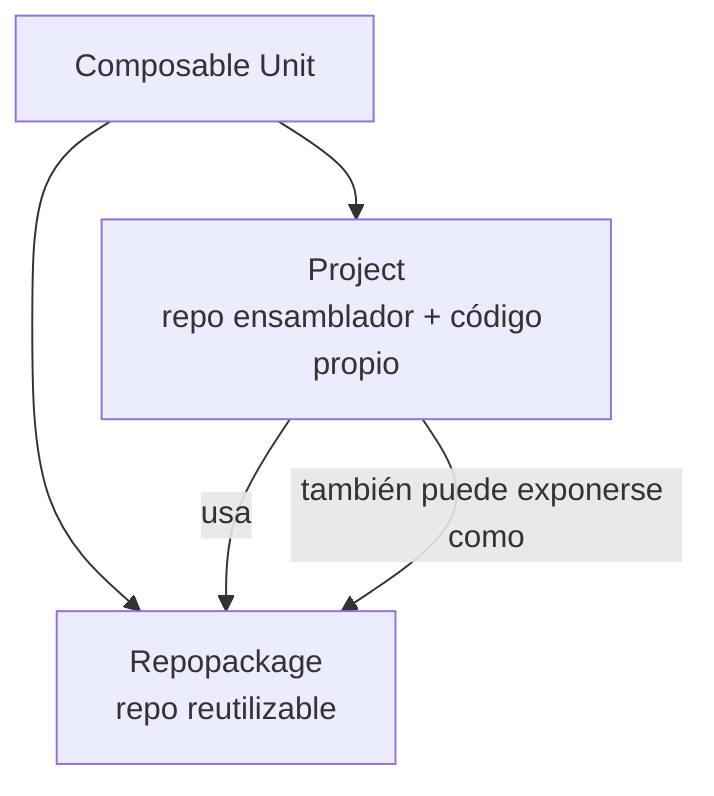
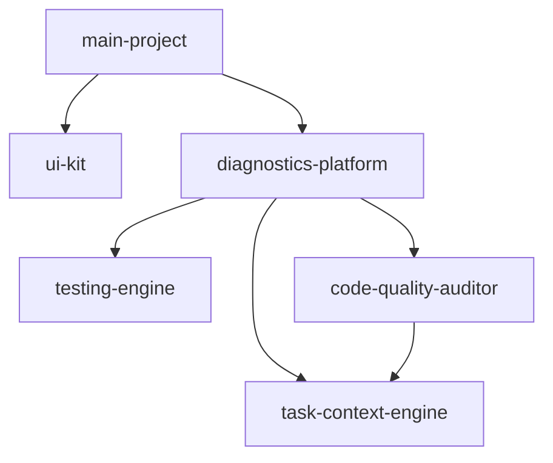
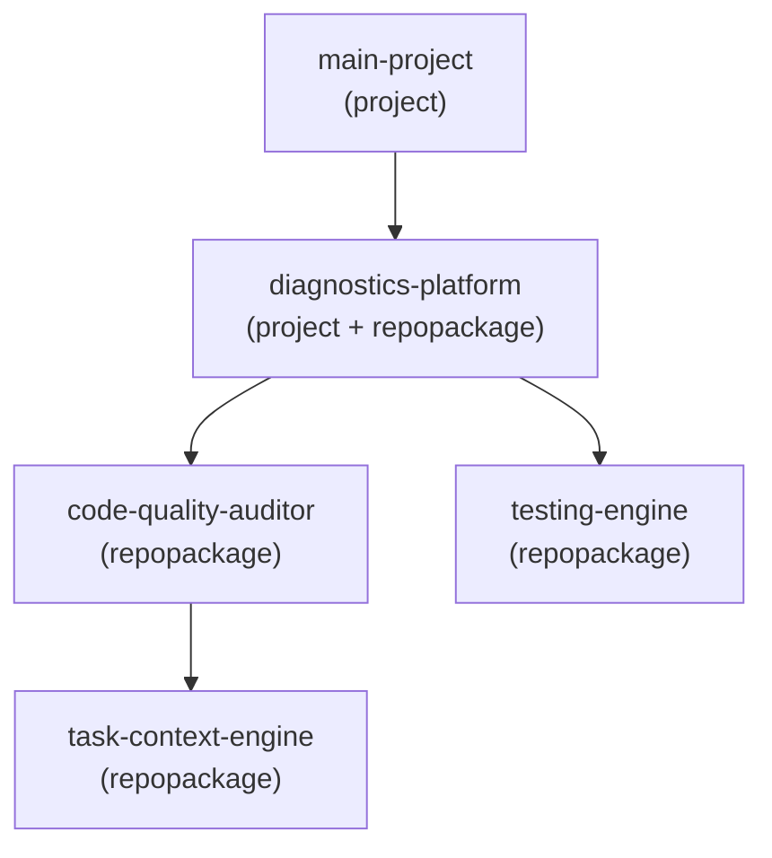
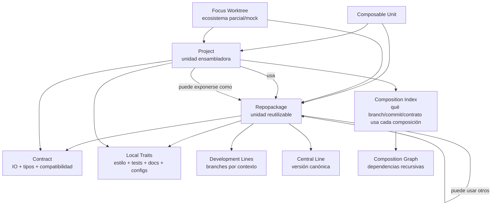

# Turn 001 - user

- Source: `Talk.md`
- Speaker: `user`

Esto es la descripcion de una libreria que estoy pensando, es texto de otro llm. lo primero, se entiende que es, para que sirve, que componentes/logicas lo componen y como se usaria?

```text

project → usa paquetes

```

sino como un sistema **recursivo**:

```text

Composable Unit

```

donde una unidad puede comportarse como **repopackage**, **project**, o ambas cosas.

---

## 1. Categorías base

```text

Repopackage

```

Unidad reutilizable con historia Git propia.

Ejemplos:

```text

task-context-engine

code-quality-auditor

testing-engine

ui-kit

docs-engine

```

Tiene:

```text

- repo Git propio

- branches propios

- contrato propio

- versión central

- particularidades internas

- tests propios

- configs propias

```

---

```text

Project

```

Unidad ensambladora que usa uno o más `repopackages`, pero también tiene código propio.

Ejemplos:

```text

project-a

project-b

project-c

main-project

```

Tiene:

```text

- código propio

- contrato de composición

- dependencias hacia repopackages

- branches propios

- tests de integración

- configs propias

```

---

```text

Composite Unit

```

Categoría más general.

Un `project` puede también comportarse como `repopackage` si otro proyecto lo usa.

Ejemplo:

```text

diagnostics-platform

```

puede ser:

```text

project

  porque usa:

    - auditor

    - testing-engine

    - ui-kit

repopackage

  porque otro proyecto puede usar diagnostics-platform como módulo

```

Entonces la abstracción correcta es:

```text

Composable Unit =

  algo con repo, contrato, historia, IO, tests y capacidad de composición

```

---

## 2. Diagrama mínimo



La idea importante:

```text

repopackage y project no son clases totalmente separadas.

Son roles.

```

Una misma unidad puede ser ambas cosas dependiendo del contexto.

---

## 3. Grafo composicional



Lectura:

```text

main-project usa diagnostics-platform.

diagnostics-platform usa auditor, testing y task-context.

auditor también usa task-context.

```

Por eso necesitas un grafo, no una lista plana.

---

# 4. Contratos

Yo separaría dos tipos de contrato.

## A. Contrato de repopackage

Define lo que el paquete promete hacia afuera.

```yaml

kind: repopackage_contract

name: code-quality-auditor

exports:

  - name: run_audit

    input: CodebaseSnapshot

    output: AuditReport

consumes:

  - name: TaskContext

    version: ">=1.0 <2.0"

integration_surface:

  schemas:

    - AuditReport.v1

    - Finding.v1

central_version:

  branch: main

  release_line: "0.x"

non_integrating_traits:

  style: ruff

  test_runner: pytest

  docs_format: markdown

```

Este contrato responde:

```text

¿Qué entrega este repo?

¿Qué consume?

¿Qué versiones son compatibles?

¿Qué parte importa para integrarlo?

¿Qué parte es solo particularidad interna?

```

---

## B. Contrato de project

Define qué puede conectarse dentro del proyecto.

```yaml

kind: project_contract

name: main-project

accepts:

  ui:

    requires:

      - ComponentRegistry.v1

  diagnostics:

    requires:

      - AuditReport.v1

      - Finding.v1

dependencies:

  code-quality-auditor:

    allowed_versions: ">=0.3 <0.5"

  ui-kit:

    allowed_versions: ">=0.2 <0.4"

composition_rules:

  - code-quality-auditor.output.AuditReport must_match ui-diagnostics.input.AuditReport

  - testing-engine.output.TestReport must_match docs-engine.input.TestReport

```

Este contrato responde:

```text

¿Qué puedo conectar?

¿Qué versiones acepto?

¿Qué outputs pueden alimentar qué inputs?

Qué combinación es válida?

```

---

# 5. Particularidades que no afectan integración

Este punto es muy importante. No todo debe entrar al contrato duro.

Separaría:

```text

Integration Contract

```

de:

```text

Local Traits

```

Ejemplo:

```yaml

integration_contract:

  exports:

    - AuditReport.v1

  consumes:

    - CodebaseSnapshot.v1

local_traits:

  formatter: ruff

  test_runner: pytest

  docs_style: mkdocs

  branch_strategy: trunk_based

  preferred_language: python

```

Las `local_traits` sirven para operar bien el repo, pero no deberían bloquear integración salvo que una política diga que sí.

Ejemplo:

```text

El auditor usa pytest.

La UI usa vitest.

Eso no importa mientras ambos expongan/consuman los contratos correctos.

```

---

# 6. Crecimiento paralelo del mismo repopackage

Esto yo lo modelaría como **líneas de desarrollo por contexto**.

Ejemplo:

```text

code-quality-auditor

  main

  project-a/experiment-doc-rules

  project-b/typescript-support

  project-c/minimal-runtime

```

Pero sin que cada branch se vuelva una versión aislada sin retorno.

Necesitas una relación explícita:

```yaml

development_lines:

  central:

    branch: main

  project_a_line:

    branch: project-a/doc-rules

    base: main

    intended_merge_target: main

    status: experimental

  project_b_line:

    branch: project-b/ts-support

    base: main

    intended_merge_target: main

    status: candidate

```

Así puedes hacer crecer el mismo paquete en paralelo, pero manteniendo referencia a una **versión central**.

---

# 7. Versión central vs versiones distribuidas

Cada `repopackage` debería tener:

```text

central version

```

y además:

```text

contextual versions

```

Ejemplo:

```yaml

repopackage: code-quality-auditor

central:

  branch: main

  version: 0.4.0

contexts:

  main-project:

    branch: main-project/auditor-rules

    based_on: main@abc123

    current_commit: def456

    integration_status: compatible

  project-b:

    branch: project-b/typescript-support

    based_on: main@abc123

    current_commit: 789abc

    integration_status: partial

```

Esto responde a tu punto 5:

```text

si en main-project hago algo que afecta algunos paquetes,

cada paquete guarda su commit en su propia historia Git,

pero el project registra que está usando esos commits.

```

No es “congelar estado” como finalidad. Es más bien:

```text

indexar qué variante de cada paquete participa en qué composición.

```

---

# 8. Índice de composición

En vez de pensar en lockfile como “congelar”, pensémoslo como:

```text

composition index

```

Ejemplo:

```yaml

kind: composition_index

project: main-project

uses:

  code-quality-auditor:

    repo: git@...

    branch: main-project/auditor-rules

    commit: def456

    based_on: main@abc123

    contract: AuditContract.v1

  ui-kit:

    repo: git@...

    branch: main

    commit: 111aaa

    contract: ComponentRegistry.v1

  testing-engine:

    repo: git@...

    branch: main-project/test-strategy

    commit: 222bbb

    based_on: main@999ccc

    contract: TestReport.v1

```

Ese índice no dice solamente “este estado funcionó”.

Dice:

```text

Este proyecto está compuesto por estas líneas de desarrollo,

en estos commits,

bajo estos contratos,

con estas relaciones de base respecto a la versión central.

```

Eso sí sirve para crecimiento paralelo.

---

# 9. Worktrees focalizados

Esto calza perfecto con tu punto 8.

Un `worktree` focalizado sería:

```text

una composición temporal de un subconjunto del ecosistema

para desarrollar/testear un repopackage sin contaminar el proyecto real

```

Ejemplo:

```text

focus-worktree: auditor-mock-ecosystem

```

Contiene:

```text

code-quality-auditor     branch: feature/new-rules

mock-task-context        branch: main

mock-project-fixture     branch: main

testing-engine           branch: main

```

Contrato:

```yaml

kind: focus_worktree

name: auditor-mock-ecosystem

target:

  repopackage: code-quality-auditor

  branch: feature/new-rules

mock_ecosystem:

  task-context-engine:

    mode: real

    ref: main

  project-fixture:

    mode: mock

    ref: fixtures/minimal-project

validates:

  - AuditReport.v1

  - Finding.v1

  - compatibility_with_project_contract.main-project

```

Así puedes testear un paquete en un ecosistema simulado sin tener que meterlo todavía en el proyecto real.

---

# 10. Recursividad: paquete de paquetes

Este es el punto más importante.

Un `repopackage` puede tener dependencias internas a otros `repopackages`.

Entonces no basta con:

```text

project → repopackage

```

Necesitas:

```text

composable unit → composable unit

```

Ejemplo:



`diagnostics-platform` es:

```text

project respecto a C, D, E

repopackage respecto a A

```

Por eso el modelo base debería ser:

```yaml

kind: composable_unit

name: diagnostics-platform

roles:

  - project

  - repopackage

uses:

  - code-quality-auditor

  - testing-engine

  - task-context-engine

exports:

  - DiagnosticsPlatform.v1

```

---

# 11. Categorías finales

Yo definiría estas categorías:

```text

1. Composable Unit

   Abstracción general. Todo lo demás deriva de esto.

2. Repopackage

   Unidad reutilizable con repo Git propio y contrato exportable.

3. Project

   Unidad que compone otros repopackages y tiene código propio.

4. Contract

   Especificación de IO, schemas, interfaces, invariantes y compatibilidad.

5. Local Traits

   Particularidades internas: estilo, test runner, docs, estructura, configs.

6. Development Line

   Rama o línea de crecimiento de un repopackage en un contexto específico.

7. Central Line

   Línea principal/canónica de un repopackage.

8. Composition Index

   Registro de qué versiones/branches/commits participan en una composición.

9. Focus Worktree

   Workspace parcial para desarrollar/testear una unidad en un ecosistema mockeado.

10. Composition Graph

   Grafo recursivo de unidades y dependencias.

```

---

# 12. Diagrama final más limpio



---

# 13. La definición central

Yo escribiría la definición así:

```text

Un repopackage es una unidad reutilizable con historia Git propia,

contrato de integración, versión central y posibles líneas de desarrollo

contextuales.

Un project es una unidad composicional que usa repopackages, tiene código

propio y declara un contrato de composición.

Ambos son casos de una composable unit, porque cualquier project puede

exponerse como repopackage y cualquier repopackage puede componerse de otros

repopackages.

```

Y la lógica que estás buscando no es “lockear estados”.

Es:

```text

mantener un grafo recursivo de unidades composables,

sus contratos,

sus líneas de desarrollo,

sus versiones centrales,

sus variantes contextuales,

y sus reglas válidas de composición.

```
