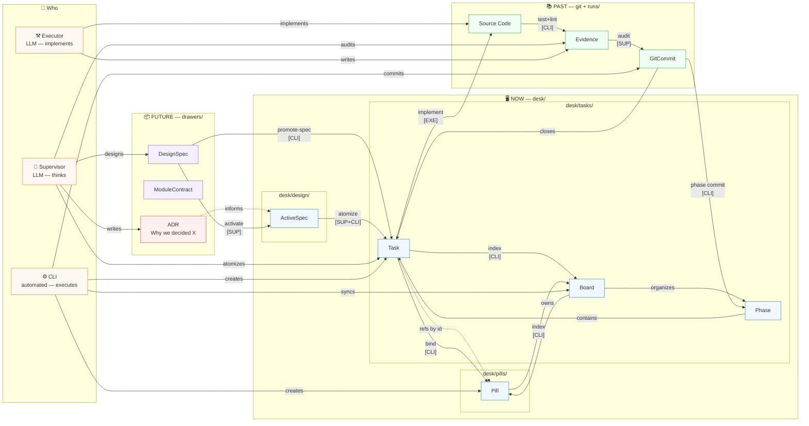

# System Map: Workflow Dimensions

## Reading Guide

| Dimension | Colour | Elements |
|-----------|--------|----------|
| **What** | — | DS, MC, T, P, B, PH, EV, GC, SRC, ADR |
| **Where / When** | Purple=future · Blue=now · Green=past | drawers/ → desk/ → git/ |
| **Who** | Orange | Supervisor, Executor, CLI |
| **How** | Arrow labels | promote-spec, atomize, bind, index, implement, audit, commit |
| **Why** | Red | ADR — informs Spec, never executes |
